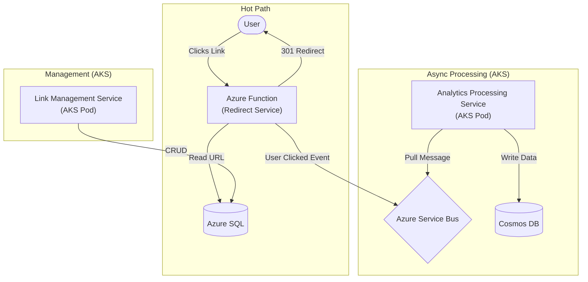

# Project Architecture

This document outlines the high-level architecture and data flow of the Cloud-Native URL Shortener.

## High-Level Flow

The system is designed for high performance and scalability, separating the critical path (redirects) from asynchronous processing (analytics).

### 1. Redirect Flow (Hot Path)
*   **Trigger**: User clicks a shortened link.
*   **Component**: **Azure Function (Redirect Service)**.
*   **Action**:
    1.  Look up the original URL in **Azure SQL** (optimized for fast reads).
    2.  Return an **HTTP 301 Permanent Redirect** to the user.
    3.  Asynchronously push a "User Clicked" event to **Azure Service Bus** (Queue).

### 2. Analytics Processing (Async Path)
*   **Trigger**: New message in Azure Service Bus.
*   **Component**: **Analytics Processing Service** (Running on **AKS**).
*   **Action**:
    1.  Pull the message from the queue.
    2.  Process/Enrich the data.
    3.  Write the raw click data to **Azure Cosmos DB**.

### 3. Link Management (Control Plane)
*   **Trigger**: Admin/User creates or edits a link via API.
*   **Component**: **Link Management Service** (Running on **AKS**).
*   **Action**:
    1.  Validate input.
    2.  Create/Update the link record in **Azure SQL**.

### 4. Analytics Querying
*   **Trigger**: User views dashboard/stats.
*   **Component**: **Analytics Query Service** (Running on **AKS**).
*   **Action**:
    1.  Query aggregated data from **Azure Cosmos DB**.
    2.  Return stats to the user.

## Basic Architecture Diagram

